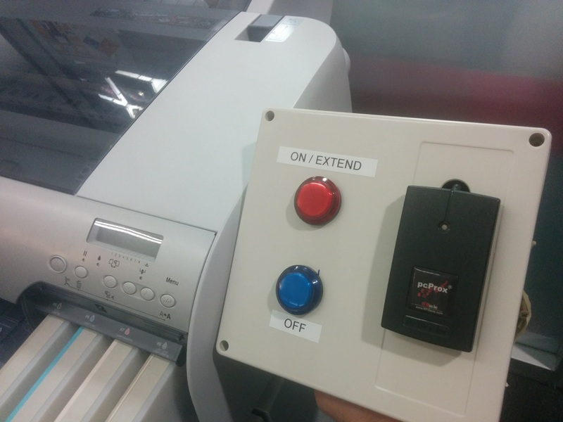

# Summary

We started this project with two goals in mind, for Google makerspaces where
employees all have the same kind of RFID badge:

1. Only people authorized (trained) should be able to use dangerous tools
2. We'd like to have reliable access logs for even non-dangerous tools

## Organization

    docs/
      Documentation on the project to include contributions on tool connectivity.
    software/
      The Python client that runs on a Pi.
    hardware/
      The custom Pi hat we use to interact with buttons and a power switch tail.

## Contributing

We *welcome* contributions, especially ones that make this more useful to other
makerspaces.  We'd like this to be a generic solution wherever possible.
