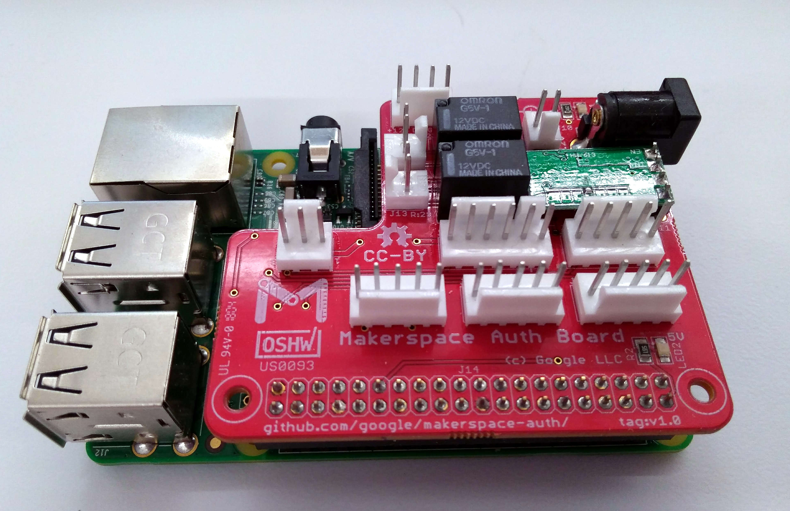

## Makerspace Auth

Like most makerspaces, we need to ensure that people have taken training before
using dangerous tools.  This is the Authbox, a project that we're sharing with
the community and welcoming contributions that help it work with more tools.

### Assembling your Authboard 1.0

* [authboard-v1.0/BOM.md](authboard-v1.0/BOM.md)
* [authboard-v1.0/Soldering.md](authboard-v1.0/Soldering.md)

### Connecting tools

* [tool-connection/epilog\_mini\_24/](tool-connection/epilog_mini_24)
* [tool-connection/bofa\_ad\_base\_1\_oracle/](tool-connection/bofa_ad_base_1_oracle)

### Connecting to servers

* [server/Protocol.md](server/Protocol.md)

### Client software

* [client/Walkthrough.md](client/Walkthrough.md)

