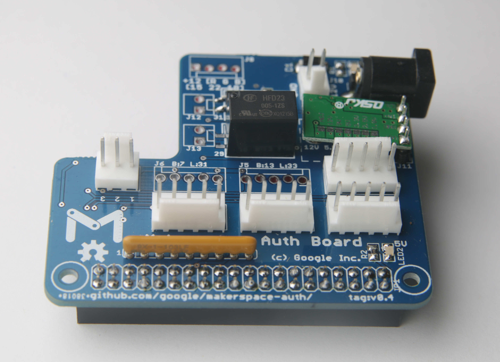

## Makerspace Auth

Like most makerspaces, we need to ensure that people have taken training before
using dangerous tools.  This is the Authbox, a project that we're sharing with
the community and welcoming contributions that help it work with more tools.

### Assembling your Authboard 1.0

* [authboard-1.0/BOM](authboard-1.0/BOM)
* [authboard-1.0/Soldering](authboard-1.0/Soldering)
* [authboard-1.0/Panel](authboard-1.0/Panel)

### Assembling your Authboard 0.4

* [authboard-0.4/BOM](authboard-0.4/BOM)

### Connecting tools

* [tool-connection/epilog\_mini\_24/](tool-connection/epilog_mini_24)
* [tool-connection/bofa\_ad\_base\_1\_oracle/](tool-connection/bofa_ad_base_1_oracle)

### Connecting to servers

* [server/Protocol](server/Protocol)

### Client software

* [client/Walkthrough](client/Walkthrough)

