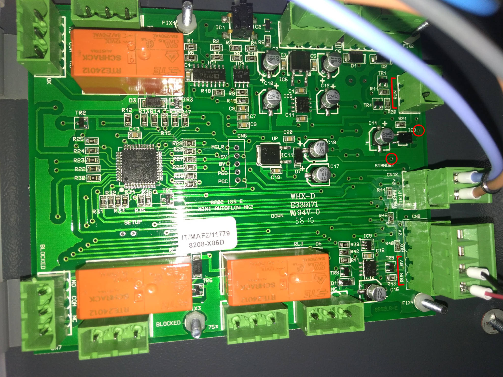
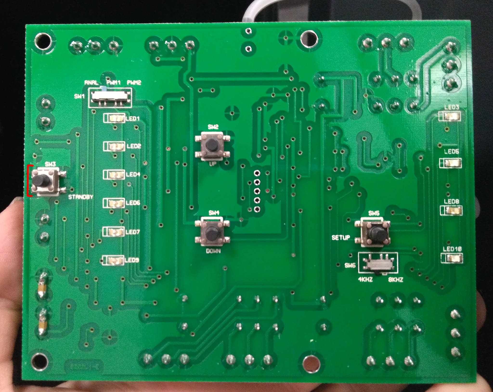
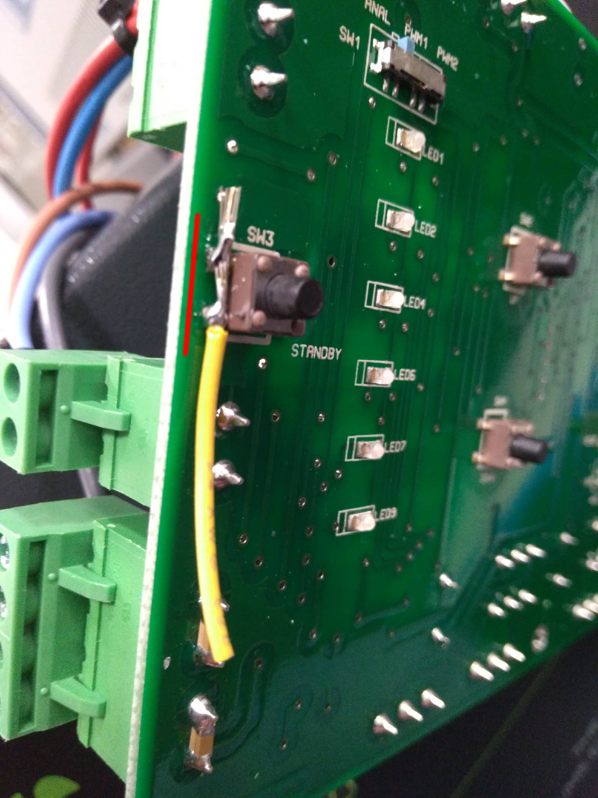
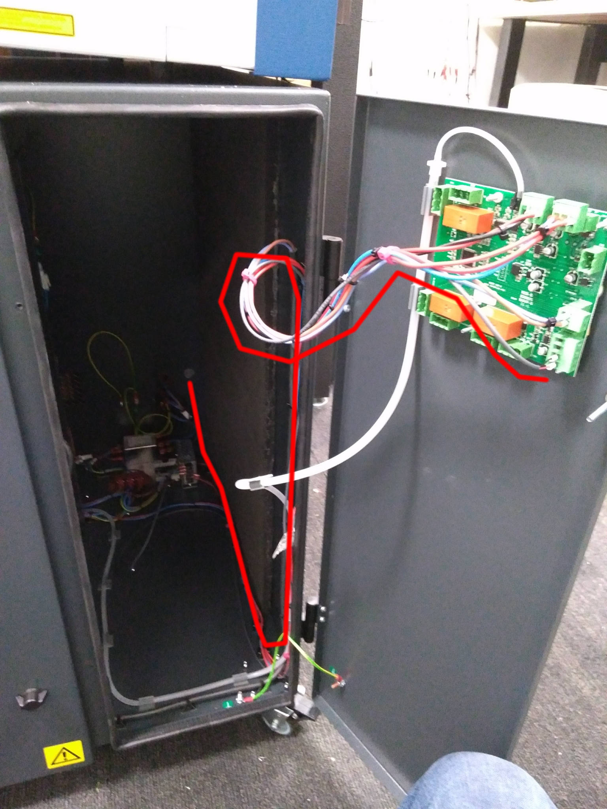

## BOFA AD Base 1 Oracle Connection

The easiest way to drive this is volt-free from J12 or J13.  Otherwise you can
use 12V from any of the buttons or J7, but check polarity.

## Volt-free input

| Item                   | Qty |
| ---------------------- | --- |
| #24 wire 2 cond x 330cm (McMaster 9290T31)| 1 |
| 25mm 3/16" heat shrink | 2 |
| white ferrules         | 2 |
| KK pin                 | 2 |
| KK 2p housing          | 1 |
| Black zip tie          | 10 |

Remove power.  Open door using T20 torx driver.  (These screws are captive, but
difficult to get started when you close it up again.)

Remove knockout on back of machine near power switch.  Feed ferrule side of
cable though.  Follow existing wire path in corner of machine up through the
door.

Marked with lines in the photo above, there are two Phoenix blocks on the right
side of the circuit board both labeled "RUN".  The one on the 4-pin block ships
with a red jumper wire.  Remove that jumper wire and screw the ferrule end
instead.  (Polarity does not matter.)

Remove the board and solder a small piece of wire across the standby switch
(SW3), or between the nearby vias from back (above text "STANDBY" and to the
right of text "IC8", marked with circles in the first photo above).

Once length is right, secure wire along with the existing bundle using zip ties.
On the outside, this cable has a vertical free run, then snakes under the Epilog
behind the rear foot, and through the plate's ziptie mount.

TODO: Exterior routing diagram.

TODO: Include knockout protector stl with cable clamp.

## 12V Input

Same as above, but you will additionally need

| Item                   | Qty |
| ---------------------- | --- |
| KK 3p housing          | 1 |
| 2p Phoenix block       | 1 |

Switch to 3-pin KK housing and use on J7 (safest), or 5-pin and use on a button
output (probably ok, assuming BOFA board includes protection diode).  Install
this in the 2-pin RUN, and mind polarity.

## Blocked sensor

There are relay outputs that trigger at 75% or fully blocked.  These are at the
bottom of the board, but we have not experimented with their use.
