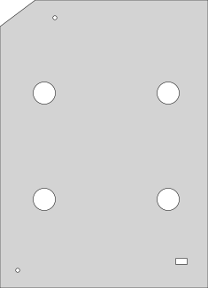
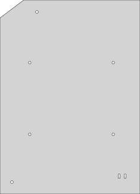
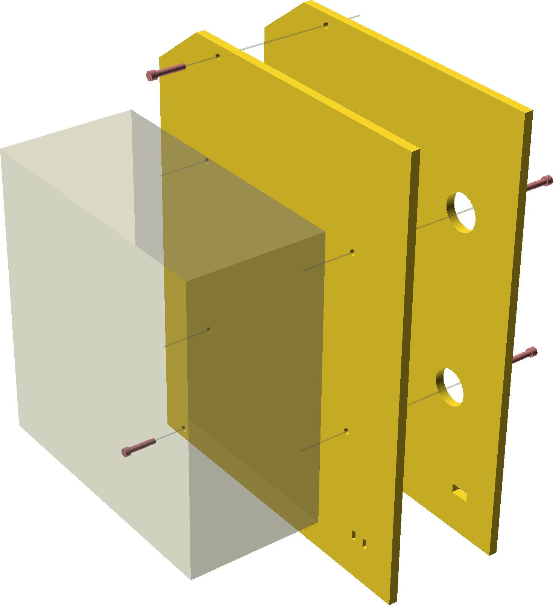
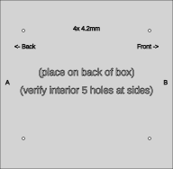
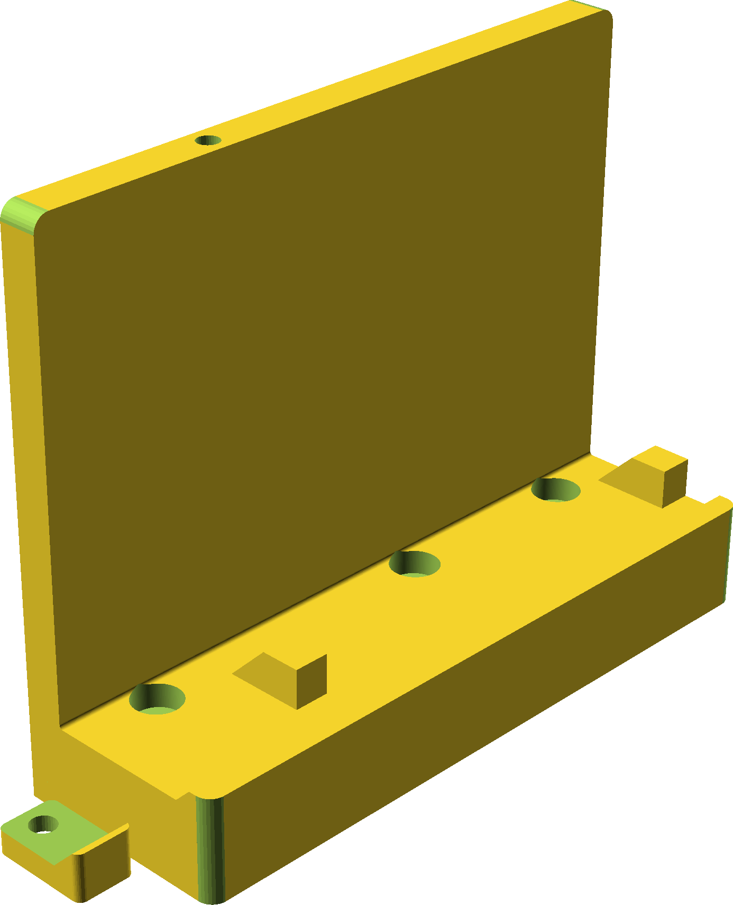
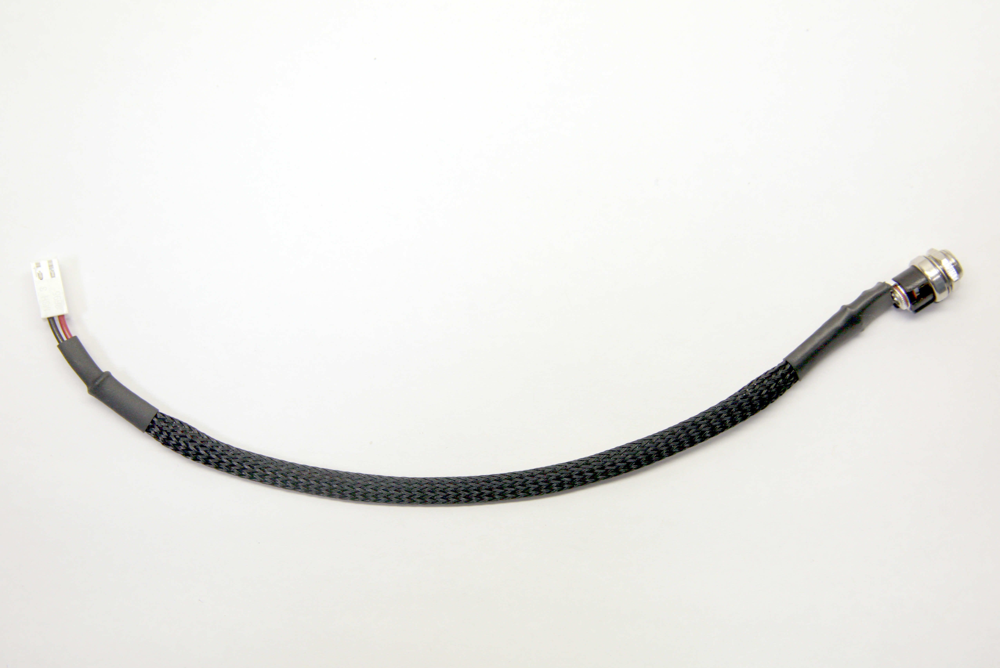
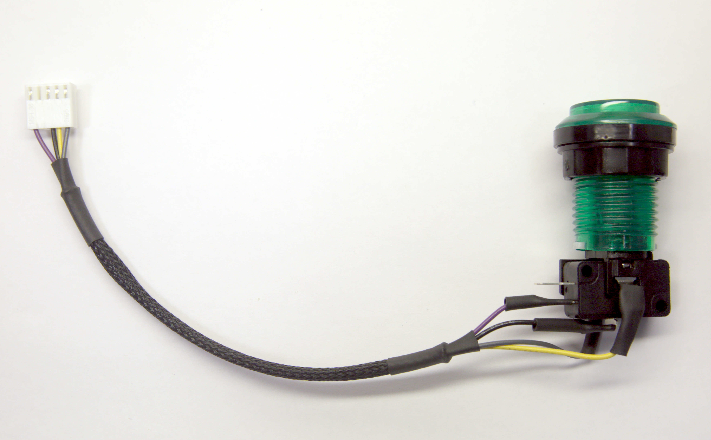
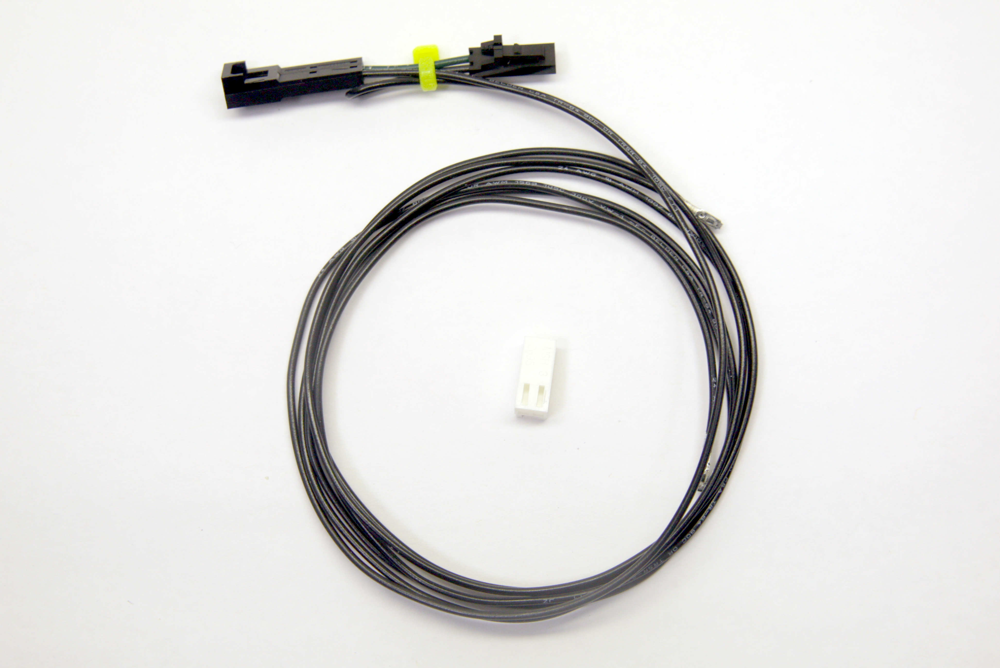

## Mini 24 Connection

There are quite a few subcomponents here, but the gist of it is we interrupt the
front door interlock unless you've successfully badged in.

### Mounting plates

Cut these out of 6mm MDF or acrylic.  You'll need the following parts to attach
your box:

 

* [inner plate](plates/one_box_mount_inner.svg)
* [outer plate](plates/one_box_mount_outer.svg)

| Item               | Qty |
| ------------------ | --- |
| M4x14              | 8   |
| M4 nut             | 8   |
| M4 (fender) washer | 8   |
| #8-32 x 7/8" or 1" | 2   |

In a pinch you can switch #8 to be M4... but either you have to get the length
perfect or be at peace with the holes being re-threaded.

### Box

This is built around a 188x193mm box that you can get
[on Amazon](https://www.amazon.com/gp/product/B0725ZQFJW) or
[Aliexpress](https://www.aliexpress.com/wholesale?SearchText=waterproof+192*188*100mm).
There's plenty of room for activities in this.

You need to drill 4 holes in the back, and some holes in the sides.  See the
hole template for details (place it on the *back* of the box, and make sure it's
in the correct orientation).

* [hole template](plates/one_box_mount_hole_template.svg)
* [lid hole template](plates/one_box_mount_lid_hole_template.svg)
* [side hole template](plates/one_box_mount_front_hole_template.svg)

### 3D-printed shelf

 

* [bracket+clip](shelf/bracket_both.stl)
* [bracket](shelf/bracket_main.stl)
* [clip](shelf/bracket_clip.stl)

### Power harness

| Item          | Qty |
| ------------- | --- |
| EJ501A jack    | 1 |
| 24 AWG red stranded, 21cm long   | 1 |
| 24 AWG black stranded, 21cm long | 1 |
| 18cm sleeving | 1 |
| 25mm 1/4" heat shrink  | 1 |
| 25mm 3/16" heat shrink | 1 |
| 12mm 1/8" heat shrink  | 2 |
| KK pin        | 2 |
| KK 2p housing | 1 |

Note the center is typically positive (red).

### Button harness

| Item          | Qty |
| ------------- | --- |
| Arcade button | 1 |
| 24 AWG purple stranded, 20cm long | 1 |
| 24 AWG black stranded, 20cm long | 1 |
| 24 AWG yellow stranded, 21cm long | 1 |
| 24 AWG gray stranded, 21cm long | 1 |
| 12.5cm sleeving | 1 |
| 25mm 3/16" heat shrink | 2 |
| 12mm 3/16" heat shrink | 4 or 5 |
| KK pin        | 4 |
| KK 5p housing | 1 |

### Epilog harness

| Item          | Qty |
| ------------- | --- |
| 24 AWG black stranded, 80cm long | 1 |
| 24 AWG black stranded, 82cm long | 1 |
| 24 AWG green stranded, 3cm long  | 1 |
| SL female pin        | 2 |
| SL 2p female housing | 1 |
| SL male pin          | 2 |
| SL 2p male housing   | 1 |
| KK pin               | 2 |
| KK 2p housing        | 1 |
| small ziptie         | 1 |

Note the KK housing is installed after routing through a hole at the bottom of
the machine.  When crimping the M-F on green, the pins should be 180 deg out of
phase in order for the clips to line up like the photo.

### On BOFA

If you're installing this above a BOFA filter, you should move the feet over to
prevent slipping.  3 feet are easy, but the right front foot has a nut on the
inside.  Remove right panel to access.

Once feet are removed, there are other holes about 4" closer to the middle that have
the same thread.
