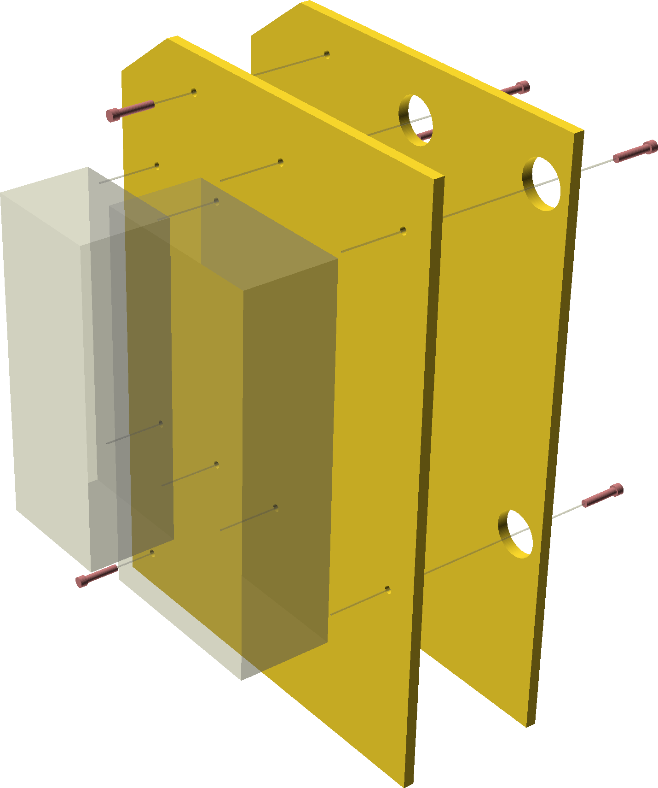

## One-box version

Very spacious, plenty of room to add an internal speaker.

| Item       | Qty |
| ---------- | --- |
| M4x14      | 8   |
| M4 nut     | 8   |
| M4 (fender) washer | 8   |
| #8-32 x 7/8" or 1" | 2   |

## Two-box version

This version allows you to put a Power Switch Tail in the rear box, while the
front one houses the Pi, buttons, and badge reader.

| Item       | Qty |
| ---------- | --- |
| M4x14      | 4   |
| M4 nut     | 4   |
| M4 (fender) washer | 4   |
| #8-32 x 7/8" or 1" | 2   |
