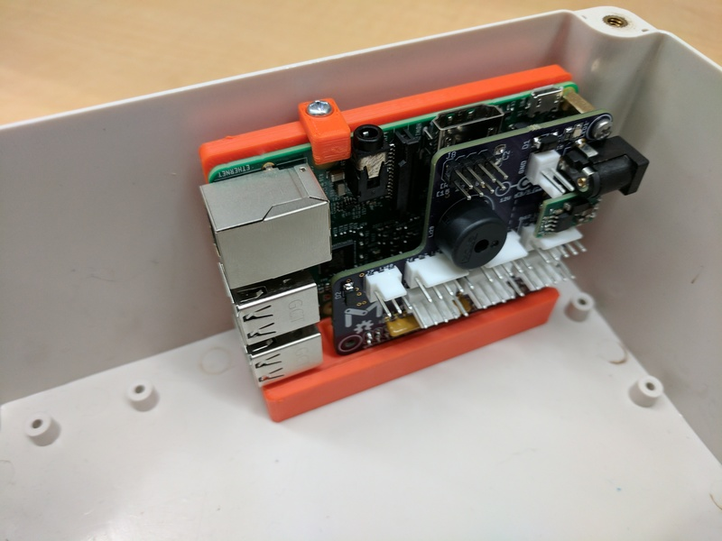

This holder fits the hole pattern found on a common unbranded 190x185x100mm box, such as https://www.amazon.com/dp/B00UBX0XH6

Source at
https://cad.onshape.com/documents/05d5fe3c5ee63c03d087e8e2/w/24837917d2c22fd129fda85b/e/478f29442292e5ba2817433a (version V1)

Assembly requires:

3x or 4x KA30x8 screws (#4x1/4" is close, but beware of stripping the threads)
1x M2.5x11 threaded standoff
2x M2.5x6 machine screws

We typically print the bracket on its largest flat face.