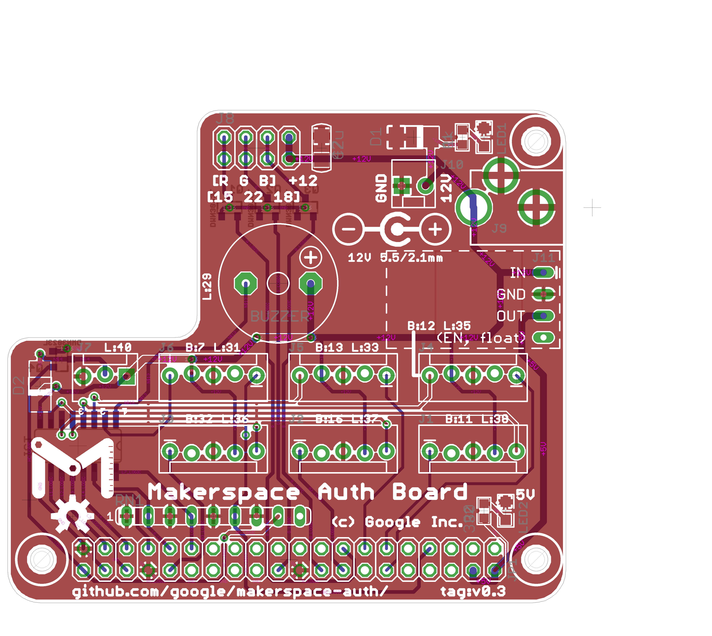
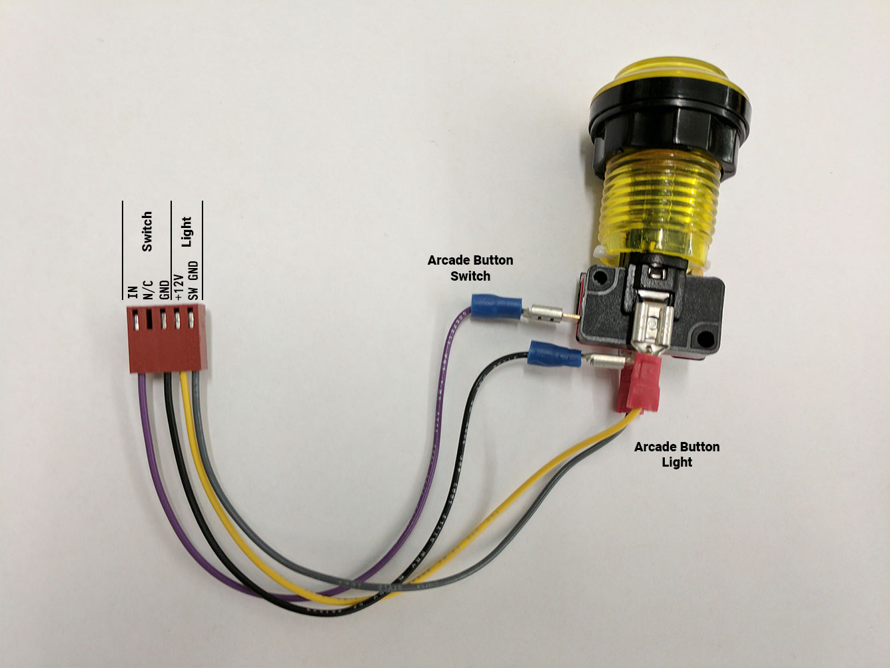
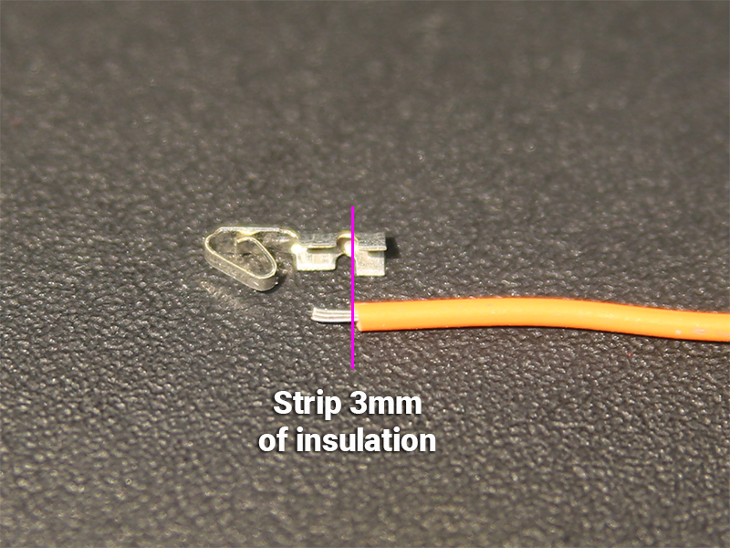
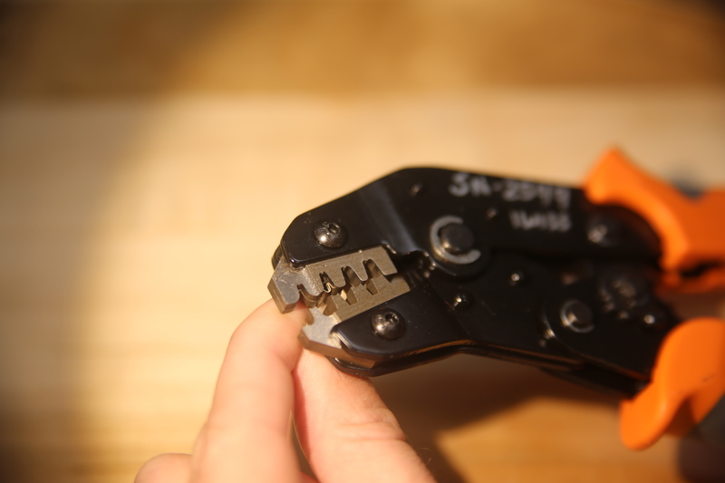
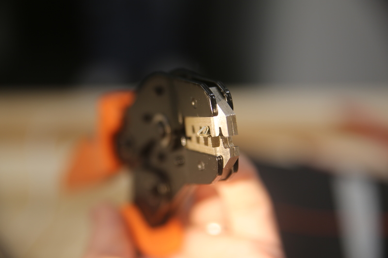
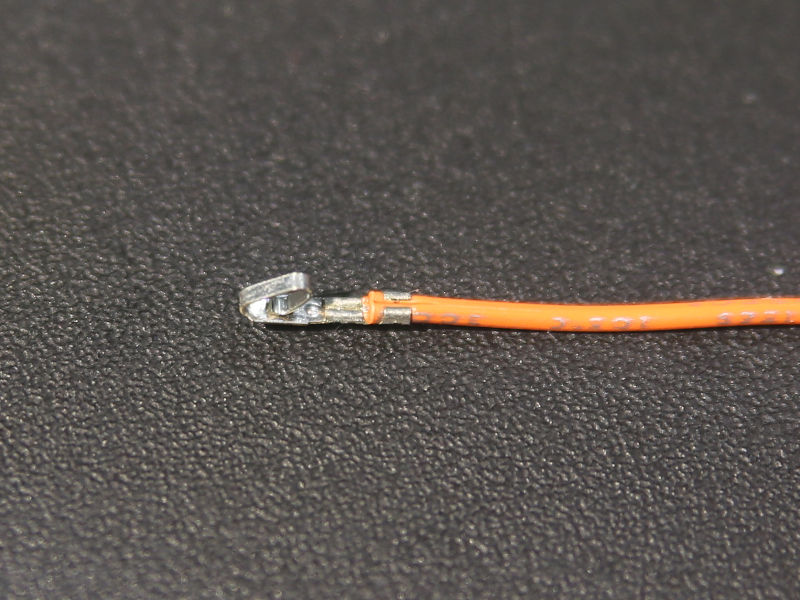
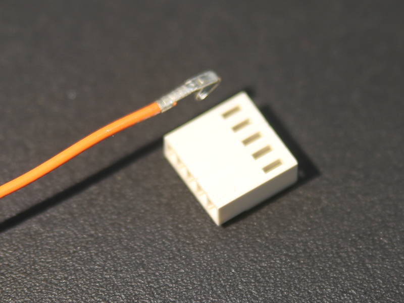

# Pi Hat 1

This is an example board that fits a Raspberry Pi.  We tried to make it fun
enough to assemble as a beginning soldering exercise (yes, even with surface
mount!), and not use anything too strange.

## Part notes

The odd board shape is to preserve easy access to CSI bus in case you're using
a camera.

We tested with 2x20 headers both cheap (eBay) and expensive
(SFH11-PBPC-D20-ST-BK at $1.97).  All fit, barely clearing the holes.

The top hole is intended as mechanical joining, but as in all Pi hats, needs an
odd size standoff (M2.5 x 11mm).

You don't need both the 2-pin and barrel supply (in fact, don't power both
simultaneously), but having the second set of pads makes probing easier.

The resistor network can be bussed or independent, either will work.  10k
appears sufficient to overpower the onboard pulldown on boot, but 4.7k (less
common) works too.

## Pinouts

The button pinout is (left-to-right with the tab facing down) is (``IN, n/c,
GND, +12V, Switched GND``).  It's intended for a light and/or button per
connector.  Arcade buttons work fairly well if your enclosure is big enough.

The only connector with a freewheeling diode is the 3-pin one marked high current.  It's intended for relay or solenoid use, like for a door.  It's fairly easy to blow the driver chip on all the others.

You can crimp or solder the switch and light side; you should crimp the Molex KK side.

## The 30-second guide to crimping Molex KK

The best tool is Molex 63811-8200, but it's very expensive (350 USD).  We used a budget crimper SN-2549 (23 USD) for these photos, which is the cheapest we've tried that does OK.

For a walkthrough of this process, University of Manchester has produced a video which details the workflow:  [https://www.youtube.com/watch?v=8jcfD1UW8SE](https://www.youtube.com/watch?v=8jcfD1UW8SE)

1. Strip 3mm of wire.

2. Insert into crimper with the open end facing you.

3. Don't crush the spring, which is on the back side, while you close a couple of clicks.  Now insert wire from the front and complete the cycle.

4. This is acceptably crimped.  It's not ideal, but acceptable.

5. Insert into housing with tiny tooth up, and the spring down in this orientation.  It should lock.
